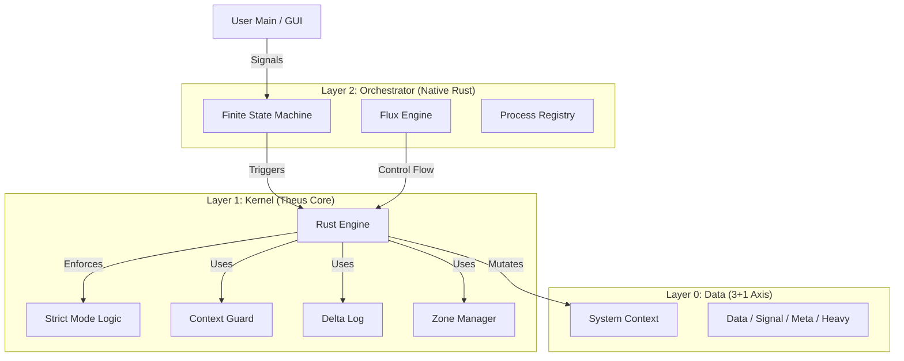

# Theus V2.2 Architecture Specification: The Iron Core (Rust Microkernel)

## 1. Tầm nhìn (Vision)
Chuyển dịch từ "Hybrid Framework" sang **"Process-Oriented Operating System"**.
Theus v2.2 sử dụng **Rust Microkernel** để đảm bảo tính đúng đắn (Correctness), an toàn bộ nhớ (Memory Safety) và hiệu năng cực độ (Zero-Copy Heavy Zone) cho các ứng dụng AI Agent.

## 2. Kiến trúc Tổng quan (High-Level Architecture)

## 3. Các thay đổi cốt lõi so với V2.1

### A. Từ Python Engine sang Rust Kernel
-   **V2.1:** `POPEngine` (Python) quản lý logic, gọi Rust module hỗ trợ.
-   **V2.2:** `theus_core::Engine` (Rust) nắm toàn quyền vòng đời. Python `TheusEngine` chỉ là wrapper mỏng.
-   **Lợi ích:** Loại bỏ hoàn toàn khả năng "bypass" từ Python (nếu bật Strict Mode).

### B. Strict Mode (Industrial Security)
-   **V2.1:** Khuyến nghị (Convention).
-   **V2.2:** Cưỡng chế (Enforcement).
    -   **Immutable Inputs:** Input được bọc trong `FrozenDict` (Rust).
    -   **Control Plane Guard:** Cấm dùng `sig_` làm input cho Data Process.
    -   **Private Audit:** Cấm truy cập `_internal` attributes.

### C. Native FSM (Determinism)
-   **V2.1:** Python loop đọc YAML và gọi hàm.
-   **V2.2:** Rust State Machine nằm ngay trong Kernel.
    -   Trạng thái chuyển đổi là Atomic.
    -   Rollback cấp độ Workflow (Chain Rollback).

### D. Heavy Zone (AI Optimization)
-   **V2.1:** Mọi dữ liệu đều qua Transaction Log (Copy-on-Write). Gây crash với Tensor 500MB+.
-   **V2.2:** Zone đặc biệt `HEAVY` (`heavy_` prefix).
    -   **Zero-Copy:** Ghi trực tiếp vào RAM.
    -   **Non-Transactional:** Không Undo được (chấp nhận mất dữ liệu Heavy khi lỗi để đổi lấy tốc độ).

## 4. Danh mục Thành phần (Updated Inventory)

| Thành phần | Ngôn ngữ | Chức năng (Role) | Thay đổi v2.2 |
| :--- | :--- | :--- | :--- |
| **Engine** | Rust | Kernel điều phối. | Chuyển từ Python sang Rust hoàn toàn. |
| **Transaction**| Rust | Quản lý Commit/Rollback. | Thêm logic `log_internal` conditional (bỏ qua Heavy). |
| **Guard** | Rust | Proxy bảo vệ Context. | Thêm logic `resolve_zone` và `Strict Mode`. |
| **FSM** | Rust | Máy trạng thái. | Thay thế `manager.py`. |
| **Registry** | Rust | Tra cứu hàm Process. | Global Registry map string -> function ptr. |

## 5. Lộ trình tiếp theo (Roadmap v3.0)
1.  **Distributed Context:** Đồng bộ trạng thái giữa nhiều Node qua mạng (Raft Protocol).
2.  **WASM Target:** Biên dịch Theus Core sang WebAssembly để chạy trên Browser (Edge AI).
