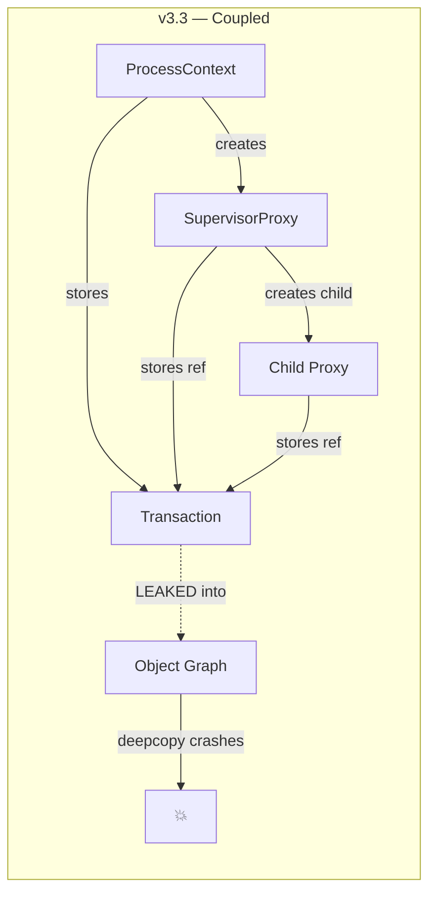
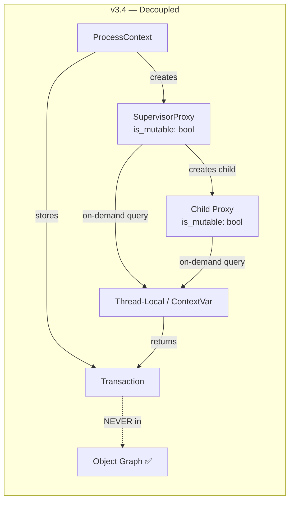

# Transaction Decoupling — Release Notes v3.4

## 1. Cấu Trúc & Triết Lý: Cũ vs Mới

### Triết lý cốt lõi

> **Infrastructure objects (Transaction) KHÔNG được tồn tại trong Data graph.**

| Khía cạnh | v3.3 (Cũ) | v3.4 (Mới) |
|-----------|-----------|------------|
| **Lưu trữ TX** | `SupervisorProxy.transaction: Option<PyObject>` — stored trực tiếp | `SupervisorProxy.is_mutable: bool` — chỉ lưu boolean |
| **Truy cập TX** | Theo reference chain trong object graph | [get_current_tx()](file:///c:/Users/dohoang/projects/EmotionAgent/theus_framework/src/proxy.rs#55-95) — thread-local → contextvars lookup |
| **Vòng đời TX** | Gắn chặt vào Proxy → leak vào deepcopy/pickle | Tách biệt hoàn toàn — Proxy không biết TX là gì |
| **Bảo vệ** | Không có — TX bị serialize/deepcopy lặng lẽ | [__reduce__](file:///c:/Users/dohoang/projects/EmotionAgent/theus_framework/src/engine.rs#853-862) + [__deepcopy__](file:///c:/Users/dohoang/projects/EmotionAgent/theus_framework/src/structures.rs#73-82) fail-fast |

### Sơ đồ kiến trúc





### Nguyên tắc thiết kế

1. **Data/Infrastructure Boundary**: Transaction là infrastructure, State là data. Chúng KHÔNG BAO GIỜ chia sẻ cùng object graph.
2. **On-demand Lookup**: TX được truy vấn khi cần (write gate, audit log, COW shadow), không được cache trong struct.
3. **Fail-fast Serialization**: Nếu TX vô tình lọt vào đường serialize, [__reduce__](file:///c:/Users/dohoang/projects/EmotionAgent/theus_framework/src/engine.rs#853-862) / [__deepcopy__](file:///c:/Users/dohoang/projects/EmotionAgent/theus_framework/src/structures.rs#73-82) sẽ raise `RuntimeError` ngay lập tức.

---

## 2. Hướng Dẫn Sử Dụng — 4 Cases

### Case 1: Tiêu Chuẩn (Typical) — Process đọc/ghi state bình thường

```python
# Đây là flow tiêu chuẩn mà 90% processes sử dụng.
# Developer KHÔNG cần thay đổi gì cả.

async def my_process(ctx):
    # ĐỌC — proxy tự wrap, is_mutable=True vì có TX
    counter = ctx.domain["counter"]  # → SupervisorProxy wraps value
    
    # GHI — proxy check is_mutable, query get_current_tx() để log_delta
    ctx.domain["counter"] = counter + 1
    
    # Nested access — child proxy inherit is_mutable từ parent
    ctx.domain["config"]["threshold"] = 0.8
```

**Hành vi v3.4**: Giống hệt v3.3. Developer không nhận thấy thay đổi. TX được tìm thấy qua thread-local (seeded bởi `ProcessContext.domain()` getter).

---

### Case 2: Liên Quan (Related) — Test harness tạo proxy trực tiếp

```python
# Test code tạo SupervisorProxy trực tiếp với MockTransaction.
# Đây là pattern phổ biến trong unit tests.

class MockTransaction:
    def __init__(self):
        self.pending_delta = []
    def log_delta(self, path, old, new):
        self.pending_delta.append((path, old, new))

def test_proxy_writes():
    data = {"x": 10}
    tx = MockTransaction()
    
    # SupervisorProxy.new() nhận tx, seed vào thread-local,
    # nhưng KHÔNG lưu tx trong struct
    proxy = SupervisorProxy(data, "domain", transaction=tx)
    proxy["x"] = 20  # ✅ Works — get_current_tx() tìm MockTx qua thread-local
    
    assert len(tx.pending_delta) > 0  # ✅ Delta logged
```

**Hành vi v3.4**: `SupervisorProxy.new(transaction=tx)` seed thread-local với tx. Mọi nested proxy đều tìm được tx qua [get_current_tx()](file:///c:/Users/dohoang/projects/EmotionAgent/theus_framework/src/proxy.rs#55-95). MockTransaction hoạt động bình thường.

> [!NOTE]
> Thread-local bị overwrite khi test mới tạo proxy mới với tx khác. Điều này an toàn vì Python GIL đảm bảo single-threaded execution.

---

### Case 3: Biên (Boundary) — Pickle/Deepcopy qua ranh giới process

```python
import copy, pickle

engine = TheusEngine()

with engine.transaction() as tx:
    # Tạo proxy thông qua ProcessContext
    ctx = create_process_context(engine, tx)
    proxy = ctx.domain
    
    # DEEPCOPY proxy — An toàn vì proxy KHÔNG chứa TX ref
    proxy_copy = copy.deepcopy(proxy)  # ✅ OK — chỉ copy inner dict
    
    # PICKLE proxy — An toàn (detached, read_only=True)
    data = pickle.dumps(proxy)  # ✅ OK
    restored = pickle.loads(data)
    assert restored.read_only == True  # Unpickled proxy luôn read-only
    
    # DEEPCOPY Transaction — FAIL-FAST (bảo vệ)
    try:
        tx_copy = copy.deepcopy(tx)  # ❌ RuntimeError!
    except RuntimeError as e:
        print(e)  # "Transaction objects cannot be deepcopied..."
```

**Hành vi v3.4**: Proxy deepcopy/pickle hoạt động vì không có TX reference trong struct. Transaction deepcopy/pickle bị chặn fail-fast.

> [!IMPORTANT]
> Đây chính là thay đổi quan trọng nhất. Trước v3.4, deepcopy proxy CRASH vì nó cố deepcopy TX C extension bên trong. Giờ điều đó không thể xảy ra.

---

### Case 4: Xung Đột (Conflict) — Multi-thread hoặc TX lifecycle mismatch

```python
import threading
from contextvars import copy_context

engine = TheusEngine()

def worker_in_thread():
    """Thread mới — thread-local & contextvars đều TRỐNG."""
    # ❌ Sai: Tạo proxy mutable KHÔNG có TX
    data = {"x": 1}
    proxy = SupervisorProxy(data, "domain", read_only=False)
    # proxy.is_mutable = False (vì transaction=None)
    try:
        proxy["x"] = 2  # ❌ PermissionError — no TX, is_mutable=False
    except PermissionError:
        print("Blocked: Cannot mutate without Transaction")
    
    # ✅ Đúng: Sử dụng engine.transaction() trong thread
    with engine.transaction() as tx:
        ctx = create_process_context(engine, tx)
        ctx.domain["x"] = 2  # ✅ TX seeded vào thread-local

# Xung đột tiềm ẩn: TX hết hạn nhưng proxy vẫn mutable
with engine.transaction() as tx:
    ctx = create_process_context(engine, tx)
    proxy = ctx.domain
    proxy["x"] = 1  # ✅ OK — TX active

# SAU with block — TX đã __exit__, nhưng thread-local có thể vẫn giữ ref
# Proxy vẫn có is_mutable=True, nhưng TX đã commit rồi!
# → An toàn vì: Engine sẽ reject CAS nếu state đã thay đổi
```

> [!CAUTION]  
> **Thread-local TX không tự động clear** khi transaction kết thúc. Trong production, `ContextGuard.__exit__` reset Python [_current_tx](file:///c:/Users/dohoang/projects/EmotionAgent/theus_framework/src/proxy.rs#55-95) contextvar. Thread-local là fallback cho tests. Nếu bạn tạo flow tùy chỉnh, hãy đảm bảo TX lifecycle được quản lý đúng.

**Bảng tổng kết xung đột:**

| Tình huống | Kết quả | Lý do |
|-----------|---------|-------|
| Proxy mutable sau TX commit | Ghi được nhưng CAS fail | Engine reject version mismatch |
| Thread mới không có TX | PermissionError | is_mutable=False |
| Deepcopy TX | RuntimeError fail-fast | [__deepcopy__](file:///c:/Users/dohoang/projects/EmotionAgent/theus_framework/src/structures.rs#73-82) guard |
| Pickle proxy qua multiprocessing | OK nhưng read-only | [__setstate__](file:///c:/Users/dohoang/projects/EmotionAgent/theus_framework/src/proxy.rs#1066-1085) set is_mutable=false |

---

## Tóm Tắt Migration

| Đối tượng | Cần thay đổi? |
|-----------|---------------|
| Process code thông thường | ❌ Không — API giữ nguyên |
| Unit tests dùng MockTransaction | ❌ Không — thread-local seed tự động |
| Custom ContextGuard/engine flow | ⚠️ Cần review — đảm bảo TX được pass qua `transaction=` param |
| Code deepcopy/pickle state | ✅ Bây giờ an toàn — không cần workaround [_strip_transaction_refs](file:///c:/Users/dohoang/projects/EmotionAgent/theus_framework/theus/engine.py#35-54) |
