# Critical Analysis: Sanity Experiment Incident Report

**Date:** 2026-03-03 | **Analyst:** Antigravity (Critical Analysis Skill) | **Scope:** `run_experiments.py --config experiments_sanity.json`

---

## Incident Registry

| ID | Bug | Root Cause Layer | Severity | File(s) |
|---|---|---|---|---|
| INC-001 | Transaction Isolation Failure | Rust-Python Boundary | **Critical** | [engine.py](file:///c:/Users/dohoang/projects/EmotionAgent/theus_framework/theus/engine.py), [guards.py](file:///c:/Users/dohoang/projects/EmotionAgent/theus_framework/theus/guards.py) |
| INC-002 | Dream Process Serialization Loss | Architecture Mismatch | **High** | [rl_agent.py](file:///c:/Users/dohoang/projects/EmotionAgent/src/agents/rl_agent.py), [snn_dream_processes.py](file:///c:/Users/dohoang/projects/EmotionAgent/src/processes/snn_dream_processes.py) |
| INC-003 | Logger PermissionError | Contract Gap | **Low** | [logger.py](file:///c:/Users/dohoang/projects/EmotionAgent/src/logger.py) |

---

## PHASE 1: THE 8 CORE ANALYTICAL RULES

### 1. Problem Statement

Ba lỗi đều chia sẻ một nguyên nhân gốc chung: **sự xung đột giữa Rust Core MVCC Transaction Model và Python Object Graph**. Rust Core yêu cầu `deepcopy` toàn bộ state data để tạo snapshot isolation. Python object graph chứa các references vòng và non-serializable objects (đặc biệt `theus_core.Transaction`). Khi hai hệ thống giao tiếp qua proxy chain, invariant "state data phải luôn picklable" bị vi phạm.

### 2. Inquiry Scope

| Câu hỏi | Trạng thái |
|---|---|
| Transaction object leak vào state bằng cách nào? | ✅ Đã xác định: qua [_sync_registry_from_core](file:///c:/Users/dohoang/projects/EmotionAgent/theus_framework/theus/engine.py#550-611) proxy chain |
| Tại sao dream processes fail riêng? | ✅ Đã xác định: `snn_context` là live Python object, bị flatten khi serialize qua Rust |
| Có bao nhiêu access path bị ảnh hưởng? | ⚠️ Đã fix 4 paths, nhưng có thể còn paths chưa trigger |
| Root fix hay workaround? | ⚠️ Hiện tại là workaround (bypass isolation). Root fix cần Rust Core thay đổi |

### 3. Data Integrity

**Dữ liệu thu thập:**
- Traceback từ 5 lần chạy thất bại với lỗi khác nhau
- Rust Core error message: `"Transaction isolation failure: cannot deepcopy object of type 'dict' at path Some(\"domain\")"`
- Debug probe output: `TRANSACTION LEAK DETECTED AT PATH: engine.state.data`

**Đánh giá:** Dữ liệu traceback đáng tin cậy. Rust Core error message cung cấp path chính xác đến object gây lỗi. Debug probe xác nhận leak location.

### 4. Conceptual Clarity

#### INC-001: Transaction Isolation Failure

**Khái niệm liên quan:** MVCC (Multi-Version Concurrency Control)

```
Transaction Lifecycle:
  __init__ → deepcopy(state.data) → snapshot    ← FAIL POINT
  execute  → mutations on snapshot
  __exit__ → compare_and_swap(snapshot, state)
```

Rust Core dùng `copy.deepcopy()` từ Python stdlib để tạo snapshot. Đây là điểm yếu thiết kế: deepcopy **không thể** handle objects có custom C extension types (`theus_core.Transaction` là PyO3 object).

**Chuỗi nhiễm bẩn (Contamination Chain):**

```mermaid
graph LR
    A[Process Execute] --> B[ContextGuard wraps ProcessContext]
    B --> C[Process mutates state via proxy]
    C --> D[Transaction commits]
    D --> E["_sync_registry_from_core()"]
    E --> F[native_proxy contains old Transaction ref]
    F --> G[proxy written back to Python context]
    G --> H[Next Transaction init]
    H --> I["deepcopy(state.data) ← CRASH"]
```



#### INC-002: Dream Process Serialization Loss

**Khái niệm liên quan:** Object Graph Serialization Boundary

`snn_context` là nested [SystemContext](file:///c:/Users/dohoang/projects/EmotionAgent/src/orchestrator/context.py#91-115) (Python dataclass) chứa live numpy arrays, neuron lists, synapse references. Khi `TheusEngine.__init__` gọi [_dump_context()](file:///c:/Users/dohoang/projects/EmotionAgent/theus_framework/theus/engine.py#107-120), nó serialize context thành flat dict → Rust Core state. Nhưng `snn_context` không thể round-trip qua serialization boundary mà không mất live references.

```
Python Context (live)          Rust Core State (serialized)
┌─────────────────────┐        ┌─────────────────────┐
│ domain_ctx:          │        │ domain_ctx:          │
│   snn_context: ──────┼───→    │   snn_context:       │
│     neurons: [obj,...]│       │     neurons: [dict,..] │ ← FLAT
│     synapses: [...]   │       │     synapses: [...]    │ ← DEAD REFS
└─────────────────────┘        └─────────────────────┘
```

#### INC-003: Logger PermissionError

**Khái niệm liên quan:** Process Contract Enforcement (RFC-001)

[ContextGuard](file:///c:/Users/dohoang/projects/EmotionAgent/theus_framework/theus/guards.py#31-637) enforce access theo `@process(inputs=[...])` contract. [log_level](file:///c:/Users/dohoang/projects/EmotionAgent/src/orchestrator/context.py#103-106) là infrastructure concern, không phải domain data, nhưng ContextGuard không phân biệt. Mọi [getattr()](file:///c:/Users/dohoang/projects/EmotionAgent/theus_framework/theus/engine.py#488-489) đều bị kiểm tra contract.

### 5. Logical Consistency

| Assertion | Consistency |
|---|---|
| "Rust Core đảm bảo isolation qua deepcopy" | ❌ Inconsistent — deepcopy fails cho PyO3 objects mà Rust Core tự tạo |
| "Process contract kiểm soát access" | ⚠️ Over-strict — infrastructure reads (logging) bị block không cần thiết |
| "Dream processes chạy qua engine.execute()" | ❌ Inconsistent — comment nói "bypass serialization" nhưng code vẫn dùng engine |

**Mâu thuẫn thiết kế chính:** Rust Core tạo Transaction objects → ghi vào state → sau đó không thể deepcopy chính Transaction objects của mình. Đây là **self-referential failure** — hệ thống tự phá vỡ invariant của chính nó.

### 6. Implications & Consequences

#### Nếu tuân thủ fix hiện tại:
- ✅ Experiment chạy thành công (đã verify 110 episodes)
- ⚠️ Dream processes bypass Rust engine → mất audit trail, không có Transaction isolation cho dream mutations
- ⚠️ RuntimeError fallback trong guards.py bypass isolation → tiềm ẩn race condition trong multi-threaded scenarios
- ⚠️ [_strip_transaction_refs](file:///c:/Users/dohoang/projects/EmotionAgent/theus_framework/theus/engine.py#35-54) chạy mỗi commit → O(n) overhead trên state size

#### Nếu không fix:
- ❌ Toàn bộ experiment pipeline bị block
- ❌ Không thể chạy bất kỳ workflow nào có > 1 sequential process

### 7. Assumptions & Presuppositions

| Assumption | Justification | Risk |
|---|---|---|
| [_strip_transaction_refs](file:///c:/Users/dohoang/projects/EmotionAgent/theus_framework/theus/engine.py#35-54) catch tất cả leak paths | Chỉ clean dict/list, không clean nested objects có `__dict__` | **Medium** — custom objects with Transaction attrs sẽ bị miss |
| Bypassing isolation cho dream processes an toàn | Dream processes là single-threaded (1 agent tại 1 thời điểm) | **Low** — nhưng nếu parallel dream thì race condition |
| [compare_and_swap](file:///c:/Users/dohoang/projects/EmotionAgent/theus_framework/theus/engine.py#523-549) không deepcopy input | Chưa verify trong Rust source | **High** — nếu CAS cũng deepcopy, pre-Transaction cleanup sẽ fail |
| RuntimeError fallback trả về đúng data | `_target` có thể stale hoặc không đồng bộ với `_inner` | **Medium** — data inconsistency tiềm ẩn |

### 8. Perspective & Breadth

**Perspective hiện tại:** Fix ở Python layer (workaround). Đây là approach **reactive** — chữa triệu chứng, không chữa bệnh.

**Alternative approaches không được chọn:**

| Approach | Pros | Cons | Lý do bỏ qua |
|---|---|---|---|
| Fix trong Rust Core: skip deepcopy cho Transaction type | Root fix, zero overhead | Cần modify + rebuild Rust binary | Không có source access tại thời điểm debug |
| Heavy Zone cho domain_ctx | Đúng theo API design (error message gợi ý) | Cần restructure toàn bộ context setup | Scope quá lớn cho hotfix |
| Custom `__deepcopy__` trên Transaction | Elegant, trong ngôn ngữ Python | Transaction là PyO3 C type, không thể add `__deepcopy__` từ Python | Technically impossible |
| Serialize-deserialize thay deepcopy | Tránh pickle hoàn toàn | Performance hit lớn, data loss tiềm ẩn | Cần Rust Core thay đổi |

---

## PHASE 2: COMPLEXITY & CASE ANALYSIS

### Model Case ✅
**Scenario:** Experiment chạy 110 episodes tuần tự, 1 experiment, single-threaded.
**Result:** Pass hoàn toàn sau fix. Sleep cycles, checkpoints, social learning đều hoạt động.

### Related Cases ⚠️

| Scenario | Risk Level | Status |
|---|---|---|
| Multi-experiment sequential run | Medium | Chưa test — Transaction leak có thể accumulate across experiments |
| Agent step pipeline (non-dream) | Low | Đã hoạt động — dùng `run_agent_step_pipeline()` direct call |
| SNN social learning processes | Medium | Access `snn_context` qua engine.execute — có thể gặp INC-002 |
| Checkpoint restore + resume | Medium | State loaded từ file → sạch, nhưng sau resume có thể re-contaminate |

### Edge Cases ⚠️

| Edge Case | Analysis |
|---|---|
| **Concurrent agents trong multi-threaded executor** | RuntimeError fallback bypass isolation → hai threads đọc cùng data mà không có snapshot isolation → **potential data corruption** |
| **State data chứa nested Transaction > 3 levels deep** | [_strip_transaction_refs](file:///c:/Users/dohoang/projects/EmotionAgent/theus_framework/theus/engine.py#35-54) chỉ recurse dict/list. Nếu Transaction nằm trong custom object (ví dụ: Pydantic model field), nó sẽ bị miss → **leak persists** |
| **Dream step exception swallowed** | [dream_step()](file:///c:/Users/dohoang/projects/EmotionAgent/src/agents/rl_agent.py#169-206) catch all Exception và chỉ log warning → silent dream failure có thể dẫn đến **SNN divergence** mà không có diagnostics |

### Conflict/Inverse Cases ❌

| Conflict Case | Impact |
|---|---|
| **Strict CAS mode enabled (`strict_cas=True`)** | Pre-Transaction cleanup gọi [compare_and_swap](file:///c:/Users/dohoang/projects/EmotionAgent/theus_framework/theus/engine.py#523-549) → bump version → actual Transaction CAS sẽ fail vì version mismatch → **infinite retry loop** |
| **Process cần isolated read (đúng mục đích Transaction isolation)** | RuntimeError fallback bypass isolation hoàn toàn → process đọc **live mutable data** thay vì snapshot → violates MVCC semantic → **correctness bug nếu process logic depends on isolation** |

---

## PHASE 3: PROPOSED SOLUTIONS & MITIGATION

### Đánh giá Fix hiện tại

| Criteria | INC-001 | INC-002 | INC-003 |
|---|---|---|---|
| **Core Resolution** | ✅ Partial — clean state + fallback | ✅ Full — direct call bypass serialization | ✅ Full — catch + default |
| **Adaptability** | ⚠️ Chỉ handle dict/list recursion | ⚠️ Tight-coupled to specific process list | ✅ Universal |
| **Resilience** | ⚠️ Strict CAS conflict case unhandled | ⚠️ Silent exception swallowing | ✅ Solid |
| **Fallback** | ✅ Original error re-raised nếu cleanup fail | ✅ Exception logged | ✅ Default to 'info' |

### Recommendations

#### Short-term (Done ✅)
Các fix hiện tại đủ để unblock experiment pipeline.

#### Medium-term (Recommended)

1. **Implement `__reduce__` trên Python side cho Transaction proxy:**
   ```python
   # Trong engine.py hoặc __init__.py
   def _unpicklable_reduce(self):
       raise TypeError("Transaction objects must not be serialized")
   theus_core.Transaction.__reduce__ = _unpicklable_reduce
   ```
   Điều này sẽ khiến deepcopy fail-fast thay vì fail-deep, giúp debug nhanh hơn.

2. **Tạo `InfrastructureAccessPolicy` cho ContextGuard:**
   ``Allow reads to ['log_level', 'agent_id', 'experiment_name']`` mà không cần khai báo trong process inputs. Phân biệt infrastructure fields và domain data.

3. **Refactor dream processes để dùng SNN engine riêng:**
   Agent đã có engine riêng (`self.engine`). Dream processes nên chạy qua SNN-specific engine với context setup đúng, không qua orchestrator engine.

#### Long-term (Rust Core)

> [!IMPORTANT]
> Root fix cần ở Rust Core: Transaction snapshot nên dùng **structural sharing** (persistent data structure) thay vì deepcopy. Hoặc ít nhất, Transaction type phải implement `__deepcopy__` trả về sentinel value.

---

## Summary

Cả 3 bugs đều là biểu hiện của **một vấn đề kiến trúc duy nhất**: ranh giới serialization giữa Python object graph và Rust Core state management. Fix hiện tại là **workaround có kiểm soát** — hoạt động cho model case (single-threaded sequential experiment) nhưng có technical debt ở 2 conflict cases (strict CAS mode, concurrent agents).

| Files Modified | Purpose |
|---|---|
| [engine.py](file:///c:/Users/dohoang/projects/EmotionAgent/theus_framework/theus/engine.py) | [_strip_transaction_refs](file:///c:/Users/dohoang/projects/EmotionAgent/theus_framework/theus/engine.py#35-54) + pre-Transaction cleanup retry |
| [guards.py](file:///c:/Users/dohoang/projects/EmotionAgent/theus_framework/theus/guards.py) | RuntimeError fallback in [__getattr__](file:///c:/Users/dohoang/projects/EmotionAgent/theus_framework/theus/engine.py#488-489) + [__getitem__](file:///c:/Users/dohoang/projects/EmotionAgent/theus_framework/theus/guards.py#381-481) |
| [rl_agent.py](file:///c:/Users/dohoang/projects/EmotionAgent/src/agents/rl_agent.py) | Direct dream process calls, bypass Rust engine |
| [snn_dream_processes.py](file:///c:/Users/dohoang/projects/EmotionAgent/src/processes/snn_dream_processes.py) | snn_context fallback access |
| [context_helpers.py](file:///c:/Users/dohoang/projects/EmotionAgent/src/orchestrator/context_helpers.py) | RuntimeError in exception handlers |
| [p_episode_runner.py](file:///c:/Users/dohoang/projects/EmotionAgent/src/orchestrator/processes/p_episode_runner.py) | RuntimeError-safe [get_domain_ctx](file:///c:/Users/dohoang/projects/EmotionAgent/src/orchestrator/context_helpers.py#11-57) |
| [logger.py](file:///c:/Users/dohoang/projects/EmotionAgent/src/logger.py) | PermissionError catch for [log_level](file:///c:/Users/dohoang/projects/EmotionAgent/src/orchestrator/context.py#103-106) |
