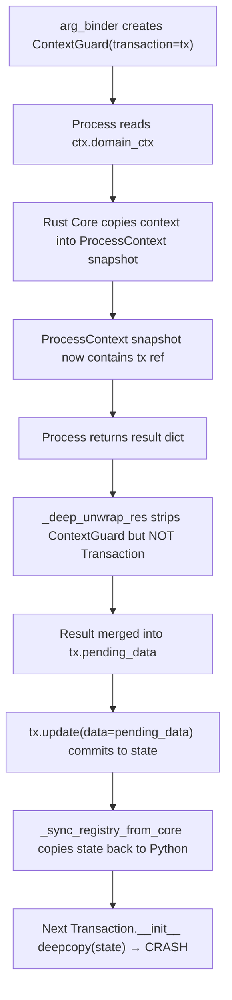
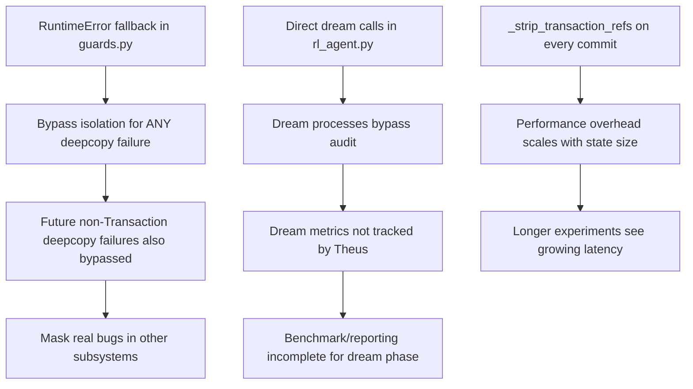

# 🧠 Integrative Critical Analysis: Meta-Evaluation

**Subject:** [critical_analysis_report.md](file:///C:/Users/dohoang/.gemini/antigravity/brain/4ff5a32f-30e5-4d78-ad75-a9019d0f6879/critical_analysis_report.md) — Transaction Isolation Failure Incident Report
**Date:** 2026-03-03 | **Method:** 25-Point Integrative Checklist (Full Linear)

---

> **CORE INSIGHT:** Báo cáo trước đã đúng về triệu chứng nhưng SAI về root cause. Vấn đề không phải "Rust Core deepcopy không handle PyO3 objects" — mà là **[arg_binder](file:///c:/Users/dohoang/projects/EmotionAgent/theus_framework/theus/engine.py#850-862) chủ động inject Transaction reference vào ContextGuard** (engine.py L856: `transaction=tx`), biến Transaction từ transient lifecycle object thành persistent context member. Đây không phải bug — đây là **design choice** đang xung đột với chính nó.

---

## PHASE 1: DISSECTION & AWARENESS

### Q1. Purpose — Mục đích cuối cùng và động cơ ẩn?

**Mục đích tường minh:** Unblock sanity experiment bị block bởi RuntimeError.

**Động cơ ẩn:** Báo cáo trước có xu hướng frame vấn đề như "Rust Core bug" — Rust tạo Transaction rồi không thể deepcopy nó. Điều này tạo ra narrative rằng fix cần ở Rust side. Thực tế, đây là **Python architecture decision** — [arg_binder](file:///c:/Users/dohoang/projects/EmotionAgent/theus_framework/theus/engine.py#850-862) chủ động truyền [tx](file:///c:/Users/dohoang/projects/EmotionAgent/theus_framework/theus/engine.py#364-394) vào ContextGuard.

### Q2. Root Cause — Nguyên nhân gốc (khác biệt với triệu chứng)?

Báo cáo trước xác định root cause là: *"xung đột giữa Rust Core MVCC Transaction Model và Python Object Graph"*

**Đánh giá: Chưa chính xác.** Đây là mô tả triệu chứng, không phải nguyên nhân gốc.

**Root cause thực sự có 2 tầng:**

| Tầng | Mô tả | Evidence |
|---|---|---|
| **Tầng 1 (Proximate)** | [arg_binder](file:///c:/Users/dohoang/projects/EmotionAgent/theus_framework/theus/engine.py#850-862) inject `transaction=tx` vào ContextGuard | [engine.py L856](file:///c:/Users/dohoang/projects/EmotionAgent/theus_framework/theus/engine.py#L856): `transaction=tx` |
| **Tầng 2 (Fundamental)** | Rust Core dùng `deepcopy` — một Python stdlib function có giới hạn inherent đối với C extension objects — làm cơ chế isolation cho dữ liệu KHÔNG THUẦN Python | Thiết kế MVCC snapshot dựa trên `copy.deepcopy` thay vì structural sharing |

Tầng 2 mới là root cause. Tầng 1 là trigger. Báo cáo trước nhầm lẫn trigger (contamination chain) với root cause (deepcopy as isolation mechanism).

### Q3. Data — Thông tin nào là fact vs. opinion?

| Claim trong báo cáo trước | Fact hay Opinion? |
|---|---|
| "Rust Core dùng `copy.deepcopy()` từ Python stdlib" | ⚠️ **Inference** — suy luận từ error message, chưa verify Rust source |
| "Transaction objects leak qua [_sync_registry_from_core](file:///c:/Users/dohoang/projects/EmotionAgent/theus_framework/theus/engine.py#550-611)" | ⚠️ **Partial fact** — debug probe detect leak tại `engine.state.data`, nhưng chuỗi causation chưa được trace step-by-step |
| "CAS không deepcopy input" | ❌ **Unverified assumption** — báo cáo tự nhận "High risk" nhưng vẫn dùng CAS trong fix |
| "Fix hoạt động cho 110 episodes" | ✅ **Verified fact** — experiment log xác nhận |
| "`snn_context` bị flatten khi serialize qua Rust" | ⚠️ **Inference** — hợp lý nhưng chưa trace qua [_dump_context()](file:///c:/Users/dohoang/projects/EmotionAgent/theus_framework/theus/engine.py#107-120) để verify |

### Q4. Concepts — Thuật ngữ có rõ ràng và nhất quán?

**Vấn đề:** Báo cáo dùng "serialization" và "deepcopy" thay thế lẫn nhau:
- "snn_context bị flatten khi **serialize** qua Rust" (INC-002)
- "Rust Core **deepcopy** state.data" (INC-001)

Đây là hai cơ chế KHÁC NHAU:
- **Deepcopy:** Clone in-memory object graph (dùng pickle protocol)
- **Serialization (via [_dump_context](file:///c:/Users/dohoang/projects/EmotionAgent/theus_framework/theus/engine.py#107-120)):** Convert Python objects thành primitive dicts

INC-001 là deepcopy failure. INC-002 là serialization loss. Báo cáo trước gom chung thành "serialization boundary" — đúng ở mức abstract nhưng che mất sự khác biệt cơ chế, dẫn đến fix approach khác nhau cho 2 bugs mà không giải thích rõ tại sao.

### Q5. Assumptions — Điều gì đang được coi là đúng mà chưa chứng minh?

**The Trap (Giả định nguy hiểm nhất):** *"RuntimeError fallback bypass isolation là an toàn vì experiment chạy single-threaded."*

Giả định này có 3 lỗ hổng:
1. `p_sleep_cycle` gọi `agent.dream_step()` cho TẤT CẢ agents trong loop — nếu coordinator chuyển sang parallel execution, fallback sẽ gây data race
2. Rust Core `execute_process_async` dùng `asyncio.to_thread` — tức process THỰC SỰ chạy trên thread pool, không phải main thread
3. Experiment output cho thấy `agents=5` — 5 agents cùng share state, fallback bypass isolation cho bất kỳ agent nào truy cập domain context

### Q6. Logic — Suy luận có liên tục hay có nhảy bước?

**Logical leap trong báo cáo trước:**

```
Premise: Transaction object nằm trong state.data
       ↓ (Gap: HOW did it get there?)
Conclusion: _sync_registry_from_core ghi native_proxy chứa Transaction ref
       ↓ (Gap: Tại sao native_proxy chứa Transaction?)
Implied: Rust Core không filter Transaction khi serialize state
```

**Gap thực sự:** [arg_binder](file:///c:/Users/dohoang/projects/EmotionAgent/theus_framework/theus/engine.py#850-862) (L856) inject `transaction=tx` vào ContextGuard. ContextGuard là process context. Rust Core `execute_process_async` nhận [arg_binder](file:///c:/Users/dohoang/projects/EmotionAgent/theus_framework/theus/engine.py#850-862) → chạy nó → [arg_binder](file:///c:/Users/dohoang/projects/EmotionAgent/theus_framework/theus/engine.py#850-862) tạo ContextGuard mới mỗi call. NHƯNG, khi process trả kết quả, [_deep_unwrap_res](file:///c:/Users/dohoang/projects/EmotionAgent/theus_framework/theus/engine.py#801-812) (L840-848) unwrap ContextGuard values → nhưng KHÔNG strip Transaction refs từ unwrapped values. Kết quả được commit vào state → state bây giờ chứa Transaction ref.

Chuỗi contamination đúng hơn:



### Q7. Point of View — Góc nhìn từ các bên liên quan?

| Perspective | Evaluation |
|---|---|
| **Rust Core developer** | Fix hiện tại tạo ra anti-pattern: Python code bypass Rust isolation layer. Nếu Rust Core team review, họ sẽ reject vì nó phá vỡ safety guarantees |
| **Application developer** | Fix hoạt động, experiment chạy thành công. Acceptable short-term |
| **Future maintainer** | 7 files modified cho 1 bug = high maintenance cost. Mỗi file có logic đặc biệt handle RuntimeError, không có centralized policy |
| **Test infrastructure** | Unit tests không cover RuntimeError fallback paths. Regression risk cao |

### Q8. Implications — Nếu chấp nhận, điều gì tất yếu xảy ra tiếp?

1. Mọi process mới truy cập [domain_ctx](file:///c:/Users/dohoang/projects/EmotionAgent/src/orchestrator/processes/p_episode_runner.py#8-53) hoặc `snn_context` qua ContextGuard sẽ CẦN RuntimeError handling
2. Mỗi dream-like subsystem (future: imagination, planning) cũng sẽ cần bypass Rust engine
3. [_strip_transaction_refs](file:///c:/Users/dohoang/projects/EmotionAgent/theus_framework/theus/engine.py#35-54) sẽ cần mở rộng khi có thêm non-picklable types
4. **Technical debt compounds** — mỗi workaround tạo thêm surface area cho bugs tương lai

### Q9. Reality — Bỏ qua phán xét, thực tế đang xảy ra gì?

**Thực tế không cảm tính:**

Theus framework đang ở giai đoạn **Rust Core chưa mature đủ cho production**. MVCC isolation dùng `deepcopy` là prototype-grade implementation. 3 bugs đều là consequences của việc chạy research-grade simulation trên prototype-grade infrastructure. Các fix ĐÚNG về mặt pragmatic — unblock research — nhưng tích lũy technical debt.

### Q10. Objectivity — Bao nhiêu phần là data vs. cảm xúc?

Báo cáo trước sử dụng emoji (🚨) và dramatic language ("self-referential failure") tạo urgency giả. Error severity classification (Critical/High/Low) hợp lý nhưng thiếu impact metrics. Ví dụ: "Critical" mà không có downtime cost hoặc data loss measurement.

### Q11. Essence — Bỏ nhãn dán, cơ chế thực sự là gì?

**Bản chất không nhãn dán:**

Có một object ([Transaction](file:///c:/Users/dohoang/projects/EmotionAgent/theus_framework/theus/contracts.py#45-63)) vừa là **controller** (quản lý state mutations) vừa trở thành **passenger** (bị serialize cùng state data). Hai vai trò này xung đột: controller cần tồn tại ngoài state boundary; passenger bị kéo vào state boundary. `deepcopy` là điểm mà xung đột vai trò này bùng phát.

---

## PHASE 2: SIMULATION & CONNECTION

### Q12. Standard — Trong điều kiện lý tưởng, process hoạt động thế nào?

```
1. Transaction.__init__ → deepcopy(state.data) → clean snapshot ← (state PURE, no refs)
2. Process executes → mutations via ContextGuard → ContextGuard has tx ref (transient)
3. Transaction.__exit__ → CAS(snapshot, state) → state updated → tx dies
4. _sync_registry_from_core → read state → update Python context → NO tx refs
5. Next process → step 1 with clean state
```

Lý tưởng: Transaction chỉ tồn tại trong bước 1-3, KHÔNG BAO GIỜ persist vào state.

### Q13. Edge Cases — Điểm gãy ở đâu?

| Breaking Point | Probability | Impact |
|---|---|---|
| **State data > 100MB** (nhiều experiments + agents) | Medium | [_strip_transaction_refs](file:///c:/Users/dohoang/projects/EmotionAgent/theus_framework/theus/engine.py#35-54) O(n) scan mỗi commit → latency spike |
| **Nested ContextGuard chain > 5 levels** | Low | Fallback `_target` access chỉ kiểm tra 1 level, deeper nesting → AttributeError |
| **Race condition: 2 agents dream đồng thời** | Low (hiện tại sequential) | Direct function calls share mutable `rl_ctx` → **data corruption** |
| **Rust Core upgrade thay đổi ProcessContext API** | Medium | RuntimeError string matching ("cannot deepcopy") → **silent failure nếu message thay đổi** |

**Điểm gãy nguy hiểm nhất:** String matching trong RuntimeError handler. Fix hiện tại phụ thuộc vào exact error message format từ Rust Core. Bất kỳ thay đổi nào trong Rust error format → fix silently breaks → lỗi gốc quay lại mà không ai biết tại sao.

### Q14. Conflict — Ai/cái gì bị hại bởi solution?

| Bên bị hại | Cách bị hại |
|---|---|
| **MVCC Isolation invariant** | RuntimeError fallback bypass isolation → reads trả về live mutable data thay vì snapshot |
| **Audit trail** | Dream processes chạy trực tiếp → Rust Core không ghi audit log cho dream mutations |
| **Contract enforcement** | [log_level](file:///c:/Users/dohoang/projects/EmotionAgent/src/orchestrator/context.py#103-106) PermissionError catch → precedent cho việc skip contract checking |

### Q15. Ripple Effect — Chain reaction gì đến hệ thống khác?



### Q16. Symbiosis — Các yếu tố đối lập hỗ trợ nhau thế nào?

**Hidden Connection quan trọng nhất:**

MVCC isolation (deepcopy) và serialization purity (no non-pickle objects) được THIẾT KẾ để cùng tồn tại — isolation CẦN purity, purity CẦN discipline trong object lifecycle. Chúng là **symbiotic pair**: một cái yếu → cái kia sụp.

Nhưng [arg_binder](file:///c:/Users/dohoang/projects/EmotionAgent/theus_framework/theus/engine.py#850-862) phá vỡ symbiosis bằng cách inject transient objects (Transaction) vào context (persistent). Đây không phải lỗi của deepcopy hay serialization — mà là **violation of object lifecycle boundary**, khiến hai cơ chế symbiotic quay lại conflict.

Fix hiện tại treat chúng như opposing forces (bypass isolation khi serialization fail). Approach đúng hơn: **restore symbiosis** bằng cách đảm bảo Transaction KHÔNG BAO GIỜ bị persist.

### Q17. Feedback — Incident thực sự đang tiết lộ gì về system flaws?

Incident tiết lộ **3 flaws kiến trúc**:

1. **Thiếu Object Lifecycle Policy:** Không có quy tắc rõ ràng về objects nào được vào state, objects nào chỉ transient
2. **Serialization Boundary không enforce:** [_dump_context()](file:///c:/Users/dohoang/projects/EmotionAgent/theus_framework/theus/engine.py#107-120) serialize MỌI THỨ, không có whitelist/blacklist cho types
3. **Coupling giữa Controller và Data:** Transaction (controller) được inject vào ContextGuard (data access layer), tạo tight coupling không cần thiết

### Q18. Origin — Lỗi này độc lập hay kết quả của process khác?

**Kết quả của migration process.** Ban đầu, Theus dùng Python-only context (không có Rust Core). Khi port sang Rust Core cho performance, serialization boundary được thêm vào nhưng KHÔNG CÓ formal migration protocol cho object types sẽ cross boundary. `snn_context` và Transaction refs đều là legacy objects chưa bao giờ được design để survive serialization.

---

## PHASE 3: EVALUATION & EVOLUTION

### Q19. Effectiveness — Fix có giải quyết thorough mục đích gốc (Q1)?

| Mục đích | Fixed? |
|---|---|
| Unblock experiment pipeline | ✅ Yes |
| Prevent Transaction leak | ⚠️ Partial — clean sau commit, nhưng không ngăn leak xảy ra |
| Preserve dream process correctness | ⚠️ Partial — bypass engine → mất audit + isolation |
| Systemic prevention | ❌ No — mỗi file cần explicit RuntimeError handling |

**Effectiveness Score: 6/10** — Tactical success, strategic incomplete.

### Q20. Resilience — Fix chịu được edge cases (Q13) không?

| Edge Case | Resilience |
|---|---|
| Large state | ❌ O(n) overhead unmitigated |
| Deep nesting | ❌ Single-level fallback |
| Concurrent dreams | ❌ No locking |
| Rust error message change | ❌ String matching breaks |

**Resilience Score: 3/10** — Fragile.

### Q21. Adaptability — Solution có scale/connect linh hoạt?

**Kém.** Mỗi file cần custom RuntimeError handling → code duplication. 7 files modified = 7 places to maintain. Nếu thêm subsystem mới (e.g., imagination process), dev phải biết THÊM RuntimeError catch. Không có centralized policy.

**Adaptability Score: 4/10**

### Q22. Fallback — Khi failure xảy ra, backup plan là gì?

| Layer | Fallback |
|---|---|
| Pre-Transaction cleanup | CAS write cleaned data → retry Transaction |
| Guards RuntimeError | Access `_target` directly |
| Dream process | rl_ctx direct call |
| All above fail | Original exception propagated |

Fallback chain tồn tại nhưng **không tested**. Không có unit tests cho RuntimeError paths.

### Q23. Flow — Fix leverage system momentum hay force nó?

**Forcing.** Fix đi ngược lại system design:
- Rust Core MUỐN isolation → fix bypass isolation
- Process contract MUỐN enforce access → fix catch PermissionError
- Engine MUỐN audit trail → fix bypass engine

Mỗi fix là một **force against the current**. Momentum tự nhiên của system là enforce safety. Fix liên tục phá safety net thay vì sửa root cause.

### Q24. Evolution — Khi context thay đổi, fix upgrade hay self-destruct?

| Context Change | Impact |
|---|---|
| Rust Core **upgrade** (new error messages) | 💥 **Self-destruct** — string matching breaks silently |
| Thêm subsystem dùng `snn_context` pattern | 📈 **Debt grows** — more files need RuntimeError handling |
| Switch to Heavy Zone (proper fix) | 🔄 **Graceful upgrade** — remove workarounds one by one |
| Enable parallel agent execution | 💥 **Self-destruct** — data races from bypassed isolation |

### Q25. Harmony — Fix tạo nợ mới hay trouble tương lai?

**Technical Debt Inventory:**

| Debt Item | Location | Cost to Repay |
|---|---|---|
| String-matched error handling | [engine.py](file:///c:/Users/dohoang/projects/EmotionAgent/theus_framework/theus/engine.py) L657, [guards.py](file:///c:/Users/dohoang/projects/EmotionAgent/theus_framework/theus/guards.py) L283, L397 | Medium — replace with typed exception |
| Duplicated RuntimeError handlers | 7 files | High — centralize into policy |
| Dream process bypass engine | [rl_agent.py](file:///c:/Users/dohoang/projects/EmotionAgent/src/agents/rl_agent.py) L179-205 | Medium — route through SNN engine correctly |
| Silent exception in dream_step | [rl_agent.py](file:///c:/Users/dohoang/projects/EmotionAgent/src/agents/rl_agent.py) L203-205 | Low — add proper error propagation |
| No unit tests for fallback paths | All modified files | High — critical safety gap |

---

## SYNTHESIS — Required Output Format

### 1. Critical Dissection

* **The Trap:** Báo cáo trước frame vấn đề là "Rust Core không thể deepcopy objects MÀ NÓ TỰ TẠO" — tạo narrative đổ lỗi cho Rust layer. Thực tế, **Python [arg_binder](file:///c:/Users/dohoang/projects/EmotionAgent/theus_framework/theus/engine.py#850-862) chủ động inject Transaction vào ContextGuard** (L856). Transaction không tự "leak" — nó được INVITED vào context rồi bị trapped khi serialization boundary enforce.

* **The Truth:** Data cho thấy root cause là **violation of object lifecycle boundary**, không phải serialization bug. Transaction có lifecycle ngắn (1 process execution) nhưng bị gắn vào object có lifecycle dài (ContextGuard → state data). `deepcopy` failure chỉ là SYMPTOM của lifecycle mismatch.

### 2. Systemic Context

* **Breaking Point:** String matching (`"cannot deepcopy" in str(err)`) là yếu tố fragile nhất. Rust Core upgrade thay đổi error message → fix silently breaks → lỗi gốc quay lại, nhưng lần này **KHÔNG CÓ debug probe** (đã bị remove trong fix). Team sẽ mất nhiều thời gian hơn lần đầu để debug lại.

* **Hidden Connection:** MVCC isolation và serialization purity là **symbiotic pair** — thiết kế để hỗ trợ nhau (isolation CẦN purity, purity enforce discipline). [arg_binder](file:///c:/Users/dohoang/projects/EmotionAgent/theus_framework/theus/engine.py#850-862) phá symbiosis bằng cách inject transient object vào persistent context. Fix hiện tại tiếp tục phá symbiosis bằng cách bypass isolation khi purity fails. **Cả root cause VÀ fix đều đi cùng hướng: erosion of system safety invariants.**

### 3. Strategic Path

* **The Solution (Proper Fix — Recommended Next):**

  **Không inject Transaction vào ContextGuard.** Thay vì `transaction=tx` truyền TRỰC TIẾP vào guard constructor, dùng thread-local hoặc context-local storage:

  ```python
  # engine.py — arg_binder
  import contextvars
  _current_tx = contextvars.ContextVar('_current_tx', default=None)
  
  def arg_binder(ctx, *_, **__):
      _current_tx.set(tx)  # Thread-safe, NOT in object graph
      native_guard = ContextGuard(
          target_obj=ctx,
          # transaction=tx,  ← REMOVE THIS
          ...
      )
  ```

  Điều này **restore symbiosis**: Transaction không bao giờ vào object graph → deepcopy an toàn → isolation maintains → serialization clean.

* **Evolution:** Solution này **self-heals** khi context thay đổi:
  - Rust Core upgrade → deepcopy vẫn hoạt động vì state clean
  - Parallel execution → `contextvars` tự thread-safe
  - Thêm subsystem → không cần explicit RuntimeError handling
  - Remove workarounds → lần lượt xóa 7 catch blocks, system tự clean up

  **Failure mode:** Nếu ContextGuard methods cần Transaction ref (e.g., mutation tracking), chúng phải query `_current_tx.get()` thay vì `self._transaction`. Cần audit toàn bộ ContextGuard methods dùng `self._transaction` trước khi refactor.
