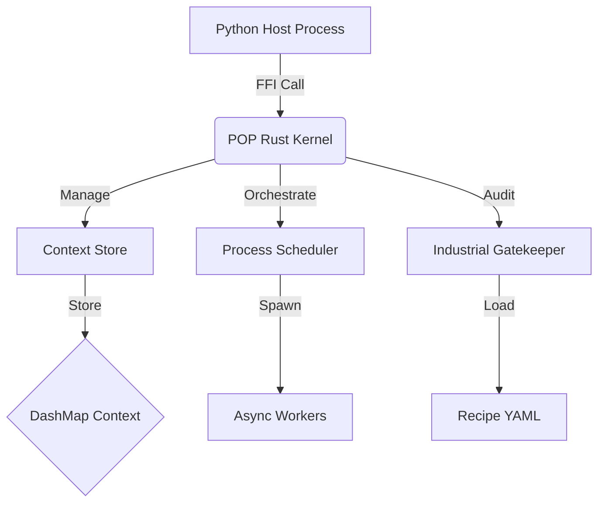

# 📐 Đặc tả Kỹ thuật: POP Rust Core Platform (Technical Specification)

> **Mã dự án:** POP-RUST-KERNEL
> **Phiên bản:** Draft 1.0
> **Triết lý:** Safe Kernel, Dynamic Periphery.

---

## 1. Kiến trúc Hệ thống (System Architecture)

### 1.1. Cấu trúc Tổng thể


### 1.2. Thành phần Cốt lõi
1.  **Engine (The Brain):**
    *   `Runtime`: Tokio Multi-thread runtime.
    *   `Scheduler`: Priority-based Task Queue.
2.  **Context Store (The Memory):**
    *   `Global`: `Arc<RwLock<HashMap<String, Value>>>` (Read-heavy).
    *   `Domain`: `Arc<DashMap<String, Value>>` (Write-heavy).
    *   **Value Type:** `PopValue` Enum (Int, Float, String, TensorRef).
3.  **Gatekeeper (The Police):**
    *   `Validator`: Zero-copy validation logic.
    *   `PolicyEngine`: Match event with Spec Rules.

---

## 2. Mô hình Đồng thời (Concurrency Model)

### 2.1. Spec-Driven Concurrency
Engine quyết định chiến lược khóa dựa trên Step Config:
*   `Mode: OPTIMISTIC` (Mặc định cho AI): Clone Context -> Run -> Merge Delta.
*   `Mode: PESSIMISTIC` (Mặc định cho Bank): Acquire WriteLock -> Run -> Release.

### 2.2. Merge Strategy Conflict Resolution
Khi 2 process cùng sửa 1 field trong chế độ Optimistic:
1.  **Check 1:** Last-Write-Wins (dựa trên timestamp nano-second).
2.  **Check 2:** Custom Resolver (nếu được khai báo trong Process Contract).

---

## 3. Giao diện Đa ngôn ngữ (Polyglot Interface)

### 3.1. Python Binding (PyO3)
*   **Struct:** `PyContext` (Wrapper quanh Rust Arc).
*   **Mechanism:**
    *   Python gọi `ctx.get("a")` -> Rust trả về bản copy.
    *   Python gọi `ctx.set("a", 1)` -> Rust ghi vào `DeltaMap` tạm thời của Process đó.
    *   Python gọi `ctx.commit()` -> Rust thực hiện Transaction Audit & Merge.

### 3.2. Side-Effect Adapter
*   **Trait:** `PopAdapter` (Rust).
*   **Impl:** `PythonAdapter` (callback ngược lên Python để dùng thư viện `requests` nếu cần, nhưng chạy trong thread pool riêng).

---

## 4. Hệ thống Audit Công nghiệp (Industrial Spec)

### 4.1. Spec Definition (YAML)
```yaml
spec:
  domain: "robotics"
  rules:
    - field: "speed"
      min: 0.0
      max: 5.0
      action: INTERLOCK
```

### 4.2. Runtime Enforcement
*   Mỗi khi `ctx.commit()` được gọi, Gatekeeper sẽ duyệt qua danh sách `Dirty Fields` (các biến đã sửa).
*   So sánh giá trị mới với Rule.
*   Nếu vi phạm -> Rollback toàn bộ Transaction -> Trả lỗi về cho Process.

---

## 5. Tiêu chuẩn Mã nguồn (Code Standards)
1.  **Safety:** Không dùng `unsafe` trừ khi tương tác FFI bắt buộc.
2.  **Error Handling:** Sử dụng `Result<T, PopError>` lan truyền tận gốc. Không bao giờ `panic!`.
3.  **Testing:** Unit Test phủ 90% logic Core. Miri test cho phần unsafe memory.
