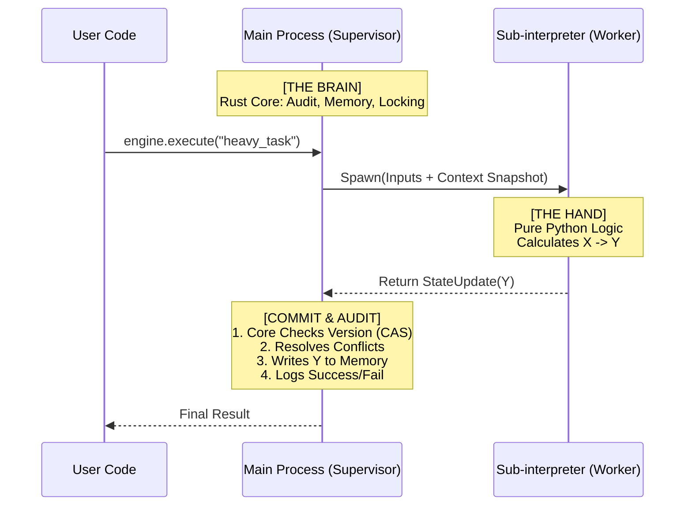

# Chapter 19: The "One Brain, Many Hands" Parallel Model

Theus v3.0 introduces a robust **Supervisor-Worker** architecture for parallel execution ('One Brain, Many Hands'). This model ensures **Data Integrity** and **Zero Trust Compliance** even when scaling across multiple CPU cores.

## 1. Architectural Overview

In this model:
*   **The Brain (Supervisor):** The Main Process running **Theus Rust Core**. It holds the "Single Source of Truth" (State), manages Memory, and performs Audit Logging.
*   **The Hands (Workers):** Sub-interpreters (or Processes) running **Pure Python**. They are stateless calculators. They receive a snapshot of data, compute, and return a result. They *cannot* modify the state directly.



## 2. Key Differences from Standard Multiprocessing

| Feature | Standard Multiprocessing | Theus Parallel Model |
| :--- | :--- | :--- |
| **State Sharing** | Shared Memory / Manager (Complex) | **Snapshot & Commit** (Simple) |
| **Data Integrity** | Manual Locking (Error Prone) | **Rust CAS (Compare-and-Swap)** |
| **Auditing** | Difficult to centralize | **Centralized in Supervisor** |
| **Worker Logic** | Can mutate global state (Chaotic) | **Stateless (Functional)** |

## 3. Usage Guide

### Step 1: Define a Parallel Task
Mark your function with `@process(parallel=True)`.
**CRITICAL:** You MUST return `StateUpdate` (or a `dict`). Mutating `ctx` inside the function has **NO EFFECT** because the worker is running on a copy of the context.

```python
from theus.contracts import process
from theus.structures import StateUpdate

@process(parallel=True)
def heavy_ai_task(ctx):
    # This runs in a separate Sub-interpreter (GIL-free)
    input_data = ctx.domain.get("image_blob")
    
    # ... expensive calculation ...
    result_score = compute_score(input_data)
    
    # RETURN the change. Do NOT do `ctx.domain['score'] = ...`
    return StateUpdate(key="score", val=result_score)
```

### Step 2: Receive the Result
The Main Process automatically handles the commit.

```python
# The engine routes this to a worker, waits for the result, 
# and then the Rust Core commits it to the central state.
await engine.execute("heavy_ai_task", image_blob=...)

# Verify
print(engine.state.data["score"]) 
```

## 4. Technical Note: The "Soft Fallback" (v3.0.22)
Due to current limitations in the Python 3.14 toolchain (specifically PyO3 bindings), the **Rust Core** module itself cannot be loaded *inside* the Sub-interpreter.

*   **Impact:** Workers run in "Pure Python Mode". They don't have access to the Rust Audit logger directly.
*   **Safety:** This does **NOT** compromise safety. If a worker crashes, the Main Process catches the exception and the **Rust Supervisor** logs the failure in the central audit trail (and triggers strict blocking if configured).
*   **Resolution:** We call this "Architectural Decoupling". It serves the same purpose as full integration but with a cleaner separation of concerns.

### 4.1 Compatibility Mode (Numpy Support)
Current versions of NumPy do not fully support Sub-interpreters. If your work involves extensive C-Extensions:
1.  Set `THEUS_USE_PROCESSES="1"` in your environment variables.
2.  Theus Engine will automatically swap the `InterpreterPool` for a standard `ProcessPool`.
3.  The API remains exactly the same (`@process(parallel=True)`).

## 5. Heavy Data (Zero-Copy)
For massive datasets (Images, Tensors), use the `ctx.heavy` Shared Memory feature (see **Chapter 10**) to avoid pickling overhead. The "Hand" receives a pointer to the memory, reads it, computes, and returns a small `StateUpdate`.

## 5. Deployment Considerations

### 5.1 Windows Support & "The Zombie Hang"
When running Theus with `THEUS_USE_PROCESSES=1` on Windows, you may encounter terminal hangs upon shutdown. This is due to `ProcessPoolExecutor` waiting for children to exit while the event loop is already closing.

**Solution:**
1.  **Always Call Shutdown:** Ensure `engine.shutdown()` is called in your `lifespan` or cleanup hook.
2.  **Use Direct Python Path:** Run `venv\Scripts\python.exe app.py` instead of `py app.py`. The `py` launcher can swallow kill signals.
3.  **Force Exit:** If using Uvicorn/FastAPI, add `os._exit(0)` to your shutdown handler to kill lingering loop threads.

```python
# server.py shutdown logic
if hasattr(engine, "shutdown"):
    engine.shutdown()
import os
os._exit(0) # Force kill windows processes
```
